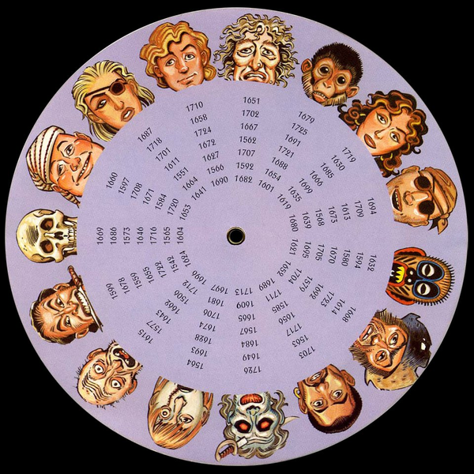
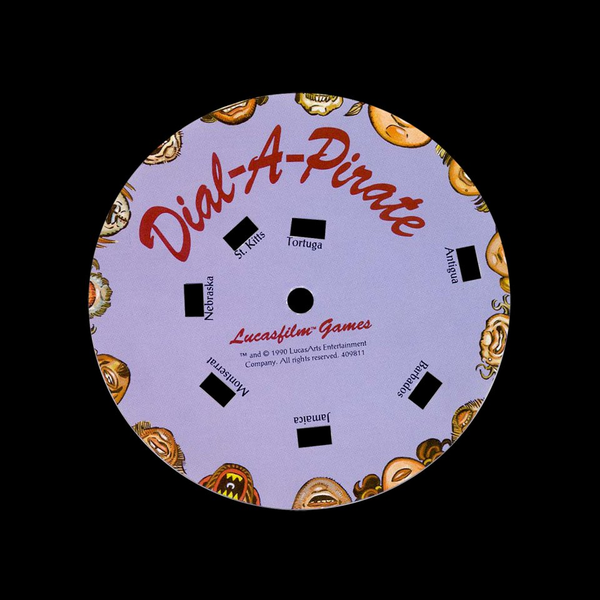
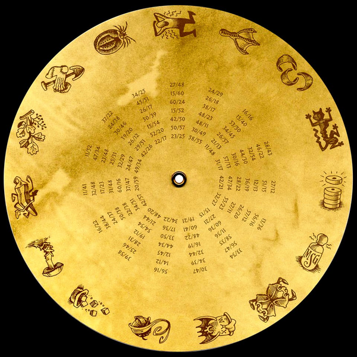
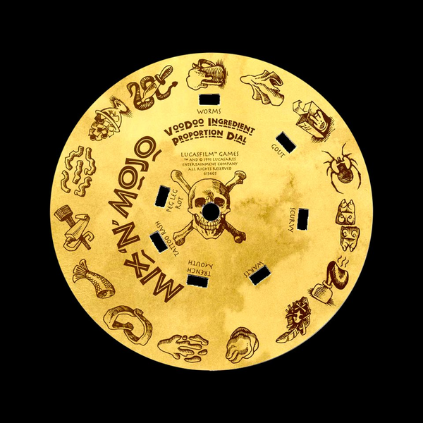

# Monkey Island Copy Protection Tools

> **Legal Notice & Disclaimer**
>
> This repository is created **solely for historical preservation and educational purposes**.
>
> The copy protection mechanisms documented here — the *Dial-a-Pirate* wheel (1990) and the *Mix 'n' Mojo Voodoo Ingredient Proportion Dial* (1991) — are physical cardboard devices that were included in the retail box of the original games published by LucasArts / LucasFilm Games. These tools **do not contain, reproduce, distribute or enable access to any copyrighted game software, game assets, audio, video or story content**.
>
> The HTML files in this repository digitally recreate only the **lookup tables and mechanical function** of the copy protection wheels — information that is widely documented in historical gaming archives, fan wikis and physical collector copies. The wheel scan images used are from personal physical copies of the original retail release.
>
> **This project does not facilitate piracy.** To use these tools with the actual games, you must own a legitimate copy (original retail, GOG, Steam). The tools are intended to assist legal owners who have lost or damaged their physical wheel — a situation explicitly acknowledged by LucasArts themselves, who offered replacement wheels for purchase.
>
> *The Secret of Monkey Island* and *Monkey Island 2: LeChuck's Revenge* are trademarks of Lucasfilm Ltd., now owned by The Walt Disney Company. This project is an unofficial fan work with no affiliation to or endorsement by LucasArts, Lucasfilm, or Disney.
>
> If you are a rights holder and believe any specific content in this repository infringes your rights, please open an issue and it will be addressed promptly.

---

Interactive HTML tools for the copy protection wheels from **The Secret of Monkey Island** (1990) and **Monkey Island 2: LeChuck's Revenge** (1991) by LucasArts.

Both tools are **fully offline** – all assets (fonts, disk images) are embedded as base64 inside a single `.html` file. No internet connection required.

---

## Files

| File | Game | Protection Type |
|------|------|----------------|
| `mi1_dialApirate.html` | The Secret of Monkey Island | Dial-a-Pirate wheel |
| `mi2_voodooCookbook.html` | Monkey Island 2: LeChuck's Revenge | Mix 'n' Mojo Voodoo Ingredient Proportion Dial |

---

## MI1 – Dial-a-Pirate

| Back disk (faces + years) | Front disk (islands) |
|---|---|
|  |  |


### How the physical wheel works

The original game box contained a cardboard wheel with two independently rotating disks. The front disk shows 15 **bottom half** pirate faces around its edge and 7 **island windows** cut into the middle. The back disk shows 15 **top half** pirate faces and a matrix of years.

When the game starts, it displays a complete pirate face and asks for the year that pirate was "hanged" at a specific island. You align the matching top half on the outer ring with the matching bottom half on the inner ring, then read the year visible through the island's window.

### Formula

```
column = Top_half_number − Bottom_half_number
if column < 0: column = column + 14
year = lookup(island, column)
```

**Example 1:** Skull (11) − Dagger (10) = **col 1** → Tortuga → **1653**  
**Example 2:** Dark Lady (2) − Skull (11) = −9 + 14 = **col 5** → Jamaica → **1628**

### Using the HTML tool

| Action | Effect |
|--------|--------|
| Drag **outer ring** | Rotates back disk (Top Half faces) |
| Drag **inner zone** (center ~55%) | Rotates front disk (Bottom Half faces) |
| Click a **Top Half** button | Snaps back disk so that face is at 12 o'clock |
| Click a **Bottom Half** button | Snaps front disk so that face is at 12 o'clock |
| Click an **Island** button | Selects island for year lookup |
| Click a cell in the **reference table** | Selects that column + island combination |

The birth year is shown automatically once all three selections are made (top half, bottom half, island).

### Face reference

| # | Top Half | # | Bottom Half |
|---|----------|---|-------------|
| 1 | Ape | 1 | Ape |
| 2 | Dark Lady | 2 | Dark Lady |
| 3 | 2 Eyeflags | 3 | Broken Nose |
| 4 | Thorn-Head | 4 | Totem-Head |
| 5 | Holed Hat | 5 | Sideburns |
| 6 | Dark Man | 6 | Mustache |
| 7 | Sword | 7 | Red Mouth |
| 8 | Big Eye | 8 | Scary Face |
| 9 | Old Man | 9 | Tongue |
| 10 | Cruel | 10 | Dagger |
| 11 | Skull | 11 | Skull |
| 12 | Cap | 12 | Cap |
| 13 | 1 Eyeflag | 13 | 1 Pimple |
| 14 | Blond | 14 | Baby Face |
| 15 | Grey Hair | 15 | Scabby Face |

### Year lookup table

| Col | Antiqua | Barbados | Jamaica | Montserrat | Nebraska | St. Kitts | Tortuga |
|-----|---------|----------|---------|------------|----------|-----------|---------|
| 0  | 1710 | 1725 | 1613 | 1692 | 1665 | 1712 | 1604 |
| 1  | 1651 | 1630 | 1580 | 1656 | 1706 | 1542 | 1653 |
| 2  | 1679 | 1709 | 1723 | 1567 | 1506 | 1565 | 1641 |
| 3  | 1719 | 1594 | 1717 | 1674 | 1722 | 1720 | 1690 |
| 4  | 1694 | 1614 | 1684 | 1662 | 1716 | 1664 | 1682 |
| 5  | 1632 | 1563 | 1628 | 1655 | 1584 | 1566 | 1601 |
| 6  | 1668 | 1649 | 1643 | 1646 | 1551 | 1647 | 1572 |
| 7  | 1713 | 1622 | 1669 | 1587 | 1686 | 1627 | 1625 |
| 8  | 1530 | 1711 | 1528 | 1724 | 1696 | 1728 | 1619 |
| 9  | 1699 | 1715 | 1698 | 1546 | 1593 | 1670 | 1586 |
| 10 | 1562 | 1618 | 1624 | 1568 | 1659 | 1704 | 1660 |
| 11 | 1718 | 1634 | 1608 | 1708 | 1548 | 1582 | 1555 |
| 12 | 1602 | 1636 | 1547 | 1645 | 1599 | 1534 | 1707 |
| 13 | 1678 | 1680 | 1691 | 1598 | 1654 | 1638 | 1640 |
| 14 | 1575 | 1703 | 1544 | 1666 | 1676 | 1714 | 1549 |

> Data verified against the original Dial-a-Pirate Code Table (LucasArts 1990).

---

## MI2 – Mix 'n' Mojo

| Back disk (proportions) | Front disk (affliction windows) |
|---|---|
|  |  |


### How the physical wheel works

The box contained a golden cardboard wheel ("Mix 'n' Mojo Voodoo Ingredient Proportion Dial") with two independently rotating disks. The front disk has 7 **affliction windows** cut into it and 15 **inner ingredients** around its edge. The back disk has 15 **outer ingredients** around its edge and a dense matrix of proportion numbers.

When the game asks for voodoo ingredient proportions, you align the two requested ingredients on the matching rings. The 7 windows then show the correct proportions for each affliction.

### Using the HTML tool

| Action | Effect |
|--------|--------|
| Drag **outer edge** | Rotates back disk (outer ingredient ring) |
| Drag **inner zone** (center ~55%) | Rotates front disk (inner ingredient ring + windows) |
| Click an **Outer Ring** ingredient | Snaps back disk to that ingredient |
| Click an **Inner Ring** ingredient | Snaps front disk to that ingredient |
| Click a cell in the **reference table** | Selects that outer+inner combination |

All seven affliction proportions are shown automatically once both ingredients are selected.

### Ingredient reference

| Letter | Outer Ring | Letter | Inner Ring |
|--------|-----------|--------|-----------|
| A | Dead Cats | A | CC of Snake Sweat |
| B | Breath Mints | B | Mugs of Grog |
| C | Sprinkles of MSG | C | Used Hankies |
| D | Crab Scalps | D | Box of Voodoo Helper |
| E | Globs of Bat Wax | E | Spider Lungs |
| F | Hair Balls | F | Pig Feet |
| G | Coffee Cup w/ Sugar | G | Drops of Skunk Extract |
| H | Deadly Toadstool | H | Owl Pellets |
| I | Bushels of Okra | I | Wads of Pre-Chewed Gum |
| J | Sprigs of Poison Oak | J | Gobs of Spit |
| K | Grave Digger's Socks | K | Sharklips |
| L | Bloated Ticks | L | Fishtails |
| M | Man w/ Smelly Armpits | M | Squirts of Peg Leg Polish |
| N | Duck Feet | N | Cheese Squigglies |
| O | Rhinoceros Toenails | O | Servings of Fruit Cocktail |

### Proportion data

The table below shows the proportion for **Worms** for all outer/inner combinations. All seven afflictions are displayed in the interactive tool.

> Data sourced from the original LucasArts (1991) physical codewheel and verified against the [Steam Community guide](https://steamcommunity.com/sharedfiles/filedetails/?id=440904699).

---

## Technical notes

### Offline self-contained

Both files embed everything internally:
- **Fonts** – Cinzel Decorative, IM Fell English, Pirata One (woff2, base64)
- **Disk images** – both wheel faces (PNG, base64)
- **No CDN, no external requests** – works without internet access

### Browser compatibility

Tested in Chrome, Firefox, Edge, Safari (desktop). Touch/drag works on mobile browsers.

### Running locally

Just open the `.html` file directly in any modern browser. No server needed.

```bash
# macOS / Linux
open mi1_dialApirate.html
open mi2_voodooCookbook.html

# Windows
start mi1_dialApirate.html
start mi2_voodooCookbook.html
```

### Note on ScummVM

If you are playing via **ScummVM** or the **Ultimate Talkie Edition**, copy protection is bypassed automatically. These tools are useful when playing:
- The original DOS floppy disk versions
- DOSBox with original disk images
- Any version that enforces copy protection

---

## License

The **code** in this repository (HTML, CSS, JavaScript) is released under the [MIT License](LICENSE).

The **wheel scan images** are reproductions of physical objects from personal retail copies. They are included under the doctrine of fair use for purposes of historical commentary, scholarship and preservation. No game executable, audio, video or narrative content is included or reproducible from this repository.

---

## Credits

- Wheel images: scans of original LucasArts physical copy protection devices
- Year data: verified against the original Dial-a-Pirate Code Table
- Proportion data: original LucasArts Mix 'n' Mojo codewheel + Steam Community guide by VolnuttHeroP64
- Games: © 1990–1991 LucasArts Entertainment Company / LucasFilm Games
